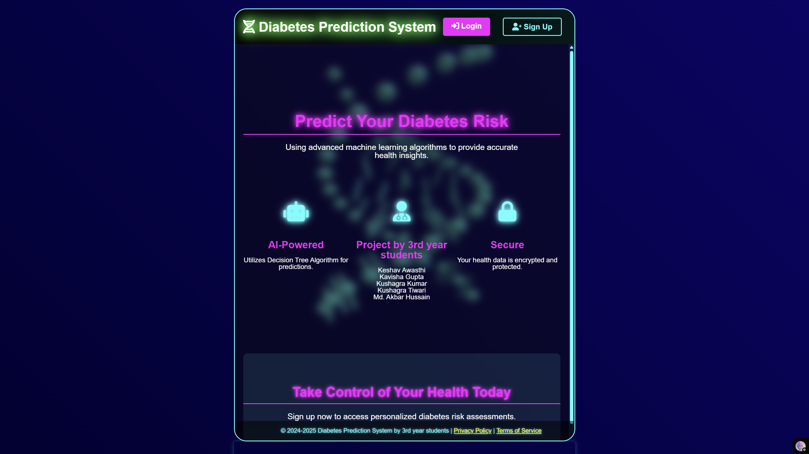
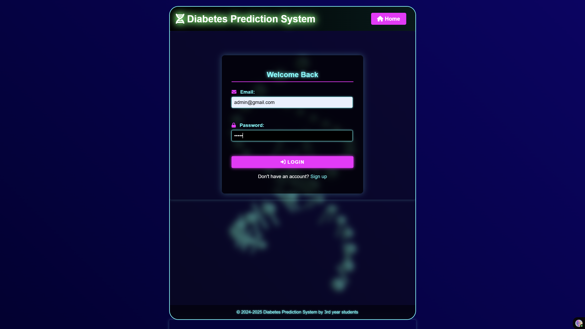
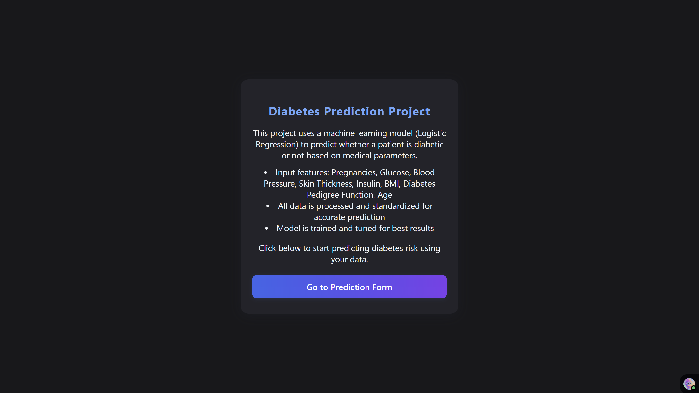
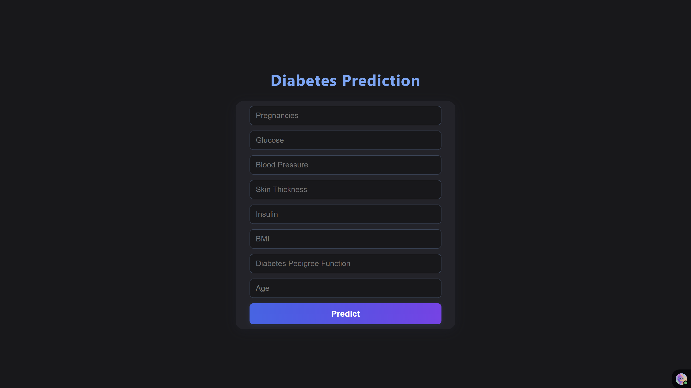

# 🎓 Diabetes Prediction using Logistic Regression (Team Project)


[](https://testforestfires-dyi0.onrender.com/predict_data)
[](https://www.python.org/)
[](https://flask.palletsprojects.com/)


This project predicts whether a person has diabetes using a logistic regression model trained on the **Pima Indians Diabetes Dataset**. It involves data preprocessing, feature scaling, model tuning, evaluation, and deployment using Flask. The project is live and accessible via the link below.

### ROC AUC Score: 0.809
> USE ```email: 'admin@gmail.com', password: '99999'```
> 
> 🚀 Live Demo: [Click here to try](https://diabetes-prediction-system-csai.netlify.app/)

---

## 📸 Preview









---

## 🧠 Features

- Logistic Regression Model for predicting diabetes.

- Data Cleaning: Replaced 0s in key columns with median values.

- Standardization using StandardScaler.

- Imbalanced Data Handling with class_weight='balanced'.

- Train/Test Split with stratification (test_size=0.2, random_state=42).

- Hyperparameter Tuning using GridSearchCV.

- Evaluation Metrics: Accuracy, Confusion Matrix, Classification Report, ROC AUC (0.809).
- Web App Interface built with Flask.
Live Deployment on Render

---

## 📦 Tech Stack

| Technology | Description |
|------------|-------------|
| `Python`   | Core language |
| `Flask`    | Backend web framework |
| `HTML/CSS` | Frontend |
| `Sklearn`  | Logistic Regression Model |
| `Render`   | Deployment |

---

## 🔢 How It Works

1. The user fills the required input on provided interface.
2. Inputs are scaled using `StandardScaler`.
3. Logistic model (**hypertuned with GridSearchCV**) predicts whether the person is **Diabetic or Not**
4. Result is displayed below the form dynamically.

---

## 🚀 Run Locally

Clone the project:

```bash
git clone https://github.com/kTechKeshav/Diabetes-Prediction-using-Logistic-Regression.git

cd Diabetes-Prediction-using-Logistic-Regression
```


## 🧠 Model Information Summary

- Model Type: Logistic Regression

- Library Used: scikit-learn

- ✅ Preprocessing Steps:
Replaced invalid zero values in features like Glucose, BloodPressure, SkinThickness, Insulin, and BMI with their median.

- Performed standardization using StandardScaler.

- Handled class imbalance using class_weight='balanced'.

- 🔍 Model Training:
Trained using train_test_split with test_size=0.2 and stratify=y.

- Applied cross-validation using StratifiedKFold.

- Hyperparameter tuning done using GridSearchCV with parameters:
```
penalty: ['l1', 'l2', 'elasticnet']

C: [100, 10, 1.0, 0.1, 0.01]

solver: ['newton-cg', 'lbfgs', 'liblinear', 'sag', 'saga']
```

- 📈 Evaluation Metrics:
Accuracy: ~78–80%

- ROC AUC Score: ~0.81

- Confusion Matrix and Classification Report used for detailed insights.

📦 Model Output:
Final trained model saved as model.pkl.


## 🙌 Author
Made with ❤️ by Keshav Awasthi

## ⭐ Feedback
If you found this project helpful or interesting, please consider giving it a ⭐ on GitHub. Your support motivates me to keep building cool stuff!
